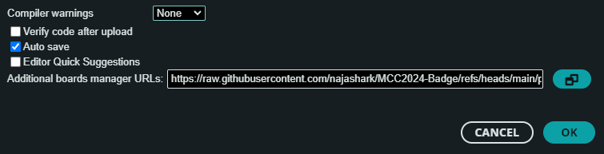
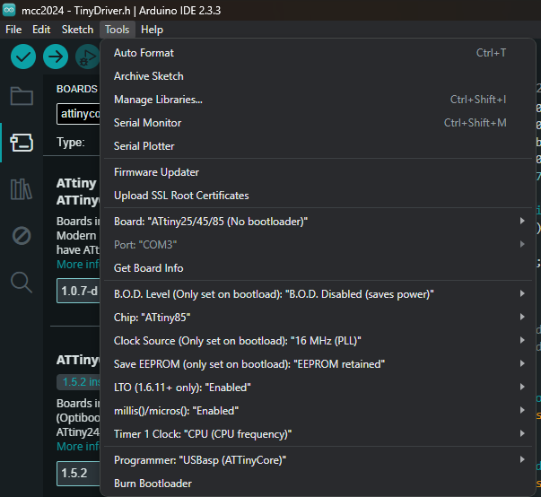

# Malaysia Cybersecurity Camp 2024 Badge

<p align="center"></center></p>

---

- ATTiny85 programmed by an Arduino AVR/USBasp via the pin header.
- Based on open Source repository from Tiny Joypad for the software.
- 128x64 SSD1306 screen.
- Requires an external programmer via an unpopulated AVR pin header.
- games/tools/api from danielc at tinyjoypad.com.
- TinyDriver.h from dschnur

---

## How to solve?

take a look at the code [here](Challenge/mcc2024.ino#L227):

```C
void drawGame() {
  static uint16_t lastX = 0xFFFF;
  static uint16_t lastY = 0xFFFF;
  static uint16_t flagX = 313;
  static uint16_t flagY = 37;

  if (playerX == flagX && playerY == flagY) {
    currentState = FLAG_SCREEN;
    noTone(4);  // Stop any active beep
    return;
  }

  ...
}

```

## How to flash?

1. Install [arduino IDE](https://www.arduino.cc/en/software)
2. Prepare programmer interface
   1. Arduino Uno setup [here](https://www.instructables.com/How-to-Program-an-Attiny85-From-an-Arduino-Uno/)
   2. USing [USBasp](https://www.fischl.de/usbasp/), can find on sopi/ladaza.
3. prepare jumper wire to the respective pin on the programmer interface
4. connect the interface to PC
5. Check for the presence of programmer interface in your device manager

   

6. Open Arduino IDE and add this to your preferences - settings

   
7. Install ATTinyCore by Spence Konde

   
8. extract [ssd1306xled-master.zip](ssd1306xled-master.zip) to this folder

```
C:\Users\lab\Documents\Arduino\libraries\ssd1306xled
```

9. Make sure to replace [TinyDriver.h](Challenge/TinyDriver.h) in your project.
10. Open your project.
11. Compile before flashing to the badge.
12. In arduino IDE, use this settings.

    

13. Click Upload, if the screen response is slow, burn bootloader and upload again.

## Pin label

Click to enlarge


